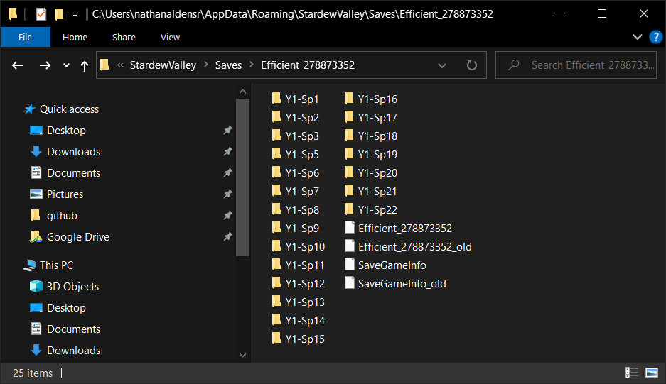

# Save files

## Directory structure

Stardew Valley save files may be located in the following directory on Windows:
```
%AppData%\StardewValley\Saves
```
Copy the directory above, open a File Explorer window, and paste the directory into the address bar. You will see a list of subdirectories. Each subdirectory corresponds to one character and is named after the farm name for each character.

Inside each subdirectory, the game stores four files: two suffixed with `_old` and two without. The two without `_old` are the current save files that will be presented and loaded in the game's *Load* screen. The two with `_old` are the previous day's save files.

## Backing up save files

When learning the run, it is incredibly useful to practice. Certain days can be very punishing, especially to a new player or a player who struggles with certain mechanics (e.g., [Fishing](https://stardewvalleywiki.com/Fishing), [Bomb](https://stardewvalleywiki.com/Bomb) usage, efficient movement, etc.)

You can backup your save files as you progress day to day. After the game notifies you that your game has been saved--this happens at the beginning of a new game or after all prompts are displayed at day's end--the game updates the contents of the subdirectory. The previous unsuffixed files are suffixed with `_old`, overwriting the old `_old` files, and the unsuffixed files are overwritten with the new content.

For example, here is how I backed up my save files while creating this guide:



## Restoring save files

If you need to restore a previous day's save files, simply copy them from wherever you backed them up to and overwrite the canonical save files. Be sure to reload the *Load* screen in-game after you do this.

## Steam Sync

Consider disabling Steam Sync if you plan on managing the save files yourself.
