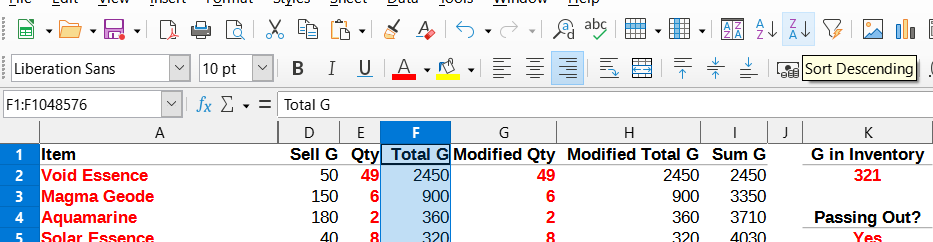

# Spreadsheet

A min-max run requires precise calculations, including selling items to earn an exact amount of G, mining and smelting Ore in exact amounts, etc. Over the course of many runs, I created a [spreadsheet](min-max.ods) in [LibreOffice Calc](https://www.libreoffice.org/download/download) to track daily information, bundle fulfillment, items and professions, and more.

Note that the spreadsheet's daily tabs are not completed yet. I will update them as I complete runs. The tabs that are present likely contain data from my actual runs until I complete enough of them to be sure of the spreadsheet's robustness.

## Which cells are editable?

Generally, cells shown in red are editable. However, you are free to modify the spreadsheet however you want. Explore!

## *Daily* tab

The *Daily* tab has four pieces of information, all of which may be selected from a drop-down list after selecting the cell. At the beginning of each day in your run, select the *Daily* tab and update the values as necessary.

1. *Season* indicates what Season it is.
2. *Day* indicates what day it is.
3. *Tomorrow's Weather* indicates what tomorrow's weather will be, as reported by the [Television](https://stardewvalleywiki.com/Television).
4. *Today's Luck* indicates what today's luck will be, as reported by the Television.

These cells do not affect any other cells.

## *Bundles* tab

The *Bundles* tab is used to track items you need for every bundle. Items that occur in multiple bundles are also listed to remind you to collect more than one of certain items.

## *Items and Professions* tab

The *Items and Professions* tab contains all the data necessary for item tracking on daily tabs to work. The list of items are not currently exhaustive, however, so please submit an [issue](https://github.com/nathan-alden-sr/stardew-valley/issues) if you notice something missing.

In general, you will not need to use this tab except to change the profession information in red. Note that changing these professions will affect all calculations done on older daily tabs; this is unavoidable.

Prices are automatically calculated using precise formulas that include proper decimal truncation.

Different combinations of base price and tiered prices are present based on whether a particular item benefits from professions, special effects (e.g., [Bear's Knowledge](https://stardewvalleywiki.com/Bear%27s_Knowledge)), both, or neither.

## *Generic Item Table* tab

The *Generic Item Table* tab presents a table where you can enter the names of items and their qualities along with a quantity. The table keeps a running sum of all the items. You can sort these tables any way you wish.

The spreadsheet automatically looks up an item by its name after you type it in. If the item supports a quality, append `<space>S` for *Silver*, `<space>G` for *Gold*, or `<space>I` for *Iridium* to the item name and the correct quality's sell price will be used.

Note the hidden *B* and *C* columns. Be sure that when creating new rows you highlight a selection of cells between `A` and `I`, then copy the cells below the existing rows. Avoid using the drag handle as it does not copy hidden cells. The tab has been pre-populated with 50 pre-filled rows for your convenience.

Many daily tabs contain copies of the generic item table for convenience.

### Determining the most valuable item stacks with which to fill your inventory

The guide often requires that you fill your inventory with the most valuable item stacks to ship. To accomplish this, fill out the table, then select the entire *Total G* column, then sort descending.

### Determining exactly what items must be shipped to reach a daily target G

Sometimes, the guide requires that you ship enough items to reach a certain target G for the following day. The principle is that by keeping G as close to zero as possible, a minimum amount of G will be lost due to the 10% penalty for passing out.

The *Qty* column is the actual quantity available for selling.

The *Modified Qty* column is the quantity of the item you actually plan on selling.

The *Sum G* column keeps a running total of the sum of all items shipped. This data is primarily used in formulas.

The *G in Inventory* cell tracks how much G you have in your inventory at that point.

The *Passing Out?* choice will apply a passing out penalty of 10% to the G in Inventory if you choose *Yes*. The final amount is represented by the *G at Day's End* cell.

*G Needed* indicates what the target G for the following day is.

*G Remaining* indicates how much more G you need to ship to reach the target. When the value is negative, it means you will have shipped more than is necessary. Usually, this is unavoidable but careful selection of the items you ship can minimize the extra income.

## Daily tabs

Daily tabs contain many different configurations depending on the needs of the day.

## Search

Many tabs include a search feature. Simply type in an item name and optionally a quality (using the syntax described above) and its prices will be displayed. This helps avoid the need to change tabs to the *Items and Professions* tab.
