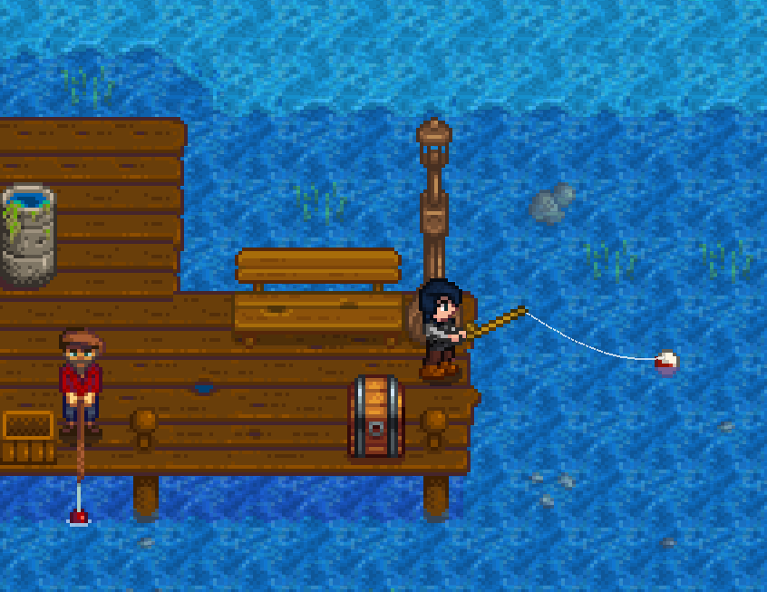

# Year 1, Spring 2

| M                          | Tu                        | W                         | Th                        | F                         | Sa                        | Su                        |
| -------------------------- | ------------------------- | ------------------------- | ------------------------- |-------------------------- | ------------------------- | ------------------------- |
| [1](year-1-spring-1.md)    | **2**                     | [3](year-1-spring-3.md)   | [4](year-1-spring-4.md)   | [5](year-1-spring-5.md)   | [6](year-1-spring-6.md)   | [7](year-1-spring-7.md)   |
| [8](year-1-spring-8.md)    | [9](year-1-spring-9.md)   | [10](year-1-spring-10.md) | [11](year-1-spring-11.md) | [12](year-1-spring-12.md) | [13](year-1-spring-13.md) | [14](year-1-spring-14.md) |
| [15](year-1-spring-15.md)  | [16](year-1-spring-16.md) | [17](year-1-spring-17.md) | [18](year-1-spring-18.md) | [19](year-1-spring-19.md) | [20](year-1-spring-20.md) | [21](year-1-spring-21.md) |
| [22](year-1-spring-22.md)  | [23](year-1-spring-23.md) | [24](year-1-spring-24.md) | [25](year-1-spring-25.md) | [26](year-1-spring-26.md) | [27](year-1-spring-27.md) | [28](year-1-spring-28.md) |

## Goals

- Reach [Fishing](https://stardewvalleywiki.com/Fishing) level 4

## Advice and warnings

- It is possible to not have enough money to buy the Fiberglass Rod and bait before Willy leaves his shop counter. If this happens, create a new game and hope for better luck finding forageables.

## Instructions

### Farming

1. Read all mail.
   - You need to read Willy's letter to be given the [Bamboo Pole](https://stardewvalleywiki.com/Bamboo_Pole).
2. Water crops.
   - Similar to foraging, stand in the center of a 3x3 box containing as many crops as possible. Drag the left mouse button over each crop to eliminate all wasted time between each watering.
3. Craft a Chest and take it with you.
   - If you did not have enough Energy on Spring 1 to chop 50 Wood, chop enough now to craft the Chest. This may not leave you with enough time to acquire the Bamboo Pole and Bait before Willy's shop closes, however.
4. Deposit all inventory into the Farmhouse Chest. Retrieve the Hoe and one Stone to go with your newly-crafted Chest.

### Fishing

Tips:

- See the [General Fishing Strategy](https://github.com/Zamiell/stardew-valley/blob/master/Min-Max_Guide.md#general-fishing-strategy) section in Zamiell's guide.
- When running low on Energy during fishing, eat items in this order:
  - [Seaweed](https://stardewvalleywiki.com/Seaweed)
  - [Joja Cola](https://stardewvalleywiki.com/Joja_Cola)
  - Highest-quality [Anchovy](https://stardewvalleywiki.com/Anchovy)
  - Highest-quality [Herring](https://stardewvalleywiki.com/Herring)
- You need to be skilled in Fishing in order to reach Fishing level 4 by the end of the day.
- Once your Fishing level is high enough, it becomes no longer necessary to fish with maximum casts. Just be sure the bobber always lands on a tile with [Fishing Zone](https://stardewvalleywiki.com/Fishing#Fishing_Zone) 5.

Instructions:

1. Travel to Pelican Town to the Garbage Can near George's house. Check it, along with the Garbage Cans next to The Stardrop Saloon and Lewis' house.
2. Travel to the Beach and acquire the Bamboo Pole.
3. Gift the Stone to Willy and claim the 100g reward.
4. Place the chest on the east-most tile on the south-most row of tiles on the pier. We will be fishing from the east-most tile on the middle row.

   
5. Fish facing right from the east-most tile using maximum casts.
6. At 8:40 am, destroy the Bamboo Pole, then head to the sand to check for forageables and Artifact Spots.
   - If you acquire an Artifact now, donate it to the Museum and claim the 250g reward, then return to the Beach.
7. Speak to Willy when he's behind the shop counter. Sell him all Beach forageables and fish. Buy the [Training Rod](https://stardewvalleywiki.com/Training_Rod) for 25g.
   - The Training Rod allows for easier perfect catches. Perfect catches increase [Experience](https://stardewvalleywiki.com/Skills) gained from fishing, which is more important than the income acquired from higher-quality fish.
8. Exit the shop, then fish below Willy's door using minimum casts.
   - Since fish quality doesn't matter with the Training Rod, there is no reason to waste time walking to the eastern end of the pier.
   - Monitor your inventory using the [spreadsheet](spreadsheet.md).
9. As soon as you have 1800g in inventory and fish value and are Fishing level 2, destroy the Training Rod, sell all the fish, and buy the Fiberglass Rod from Willy. Buy as much Bait as possible and equip the Bait on the Fiberglass Rod.
   - It's now more difficult to perfect catch due to only being Fishing level 2, but the Bait's reduction of bobber time combined with catching fish of silver or higher quality more than make up for it.
   - Now that you have the Fiberglass Rod, Fishing Zone consideration applies.
10. Fish from the east-most tile of the pier using maximum casts to start.
    - If you do not have at least 35 Bait on the rod at 4:30 pm, buy more Bait from Willy. This ensures you have enough Bait for the rest of the day and for tomorrow morning.
    - Fish until 1:50 am.
11. Leave all of the fish in the chest so we can sell them to Willy tomorrow.
12. Pass out.

## Day's end

- Foraging level 0 ⟶ 4
