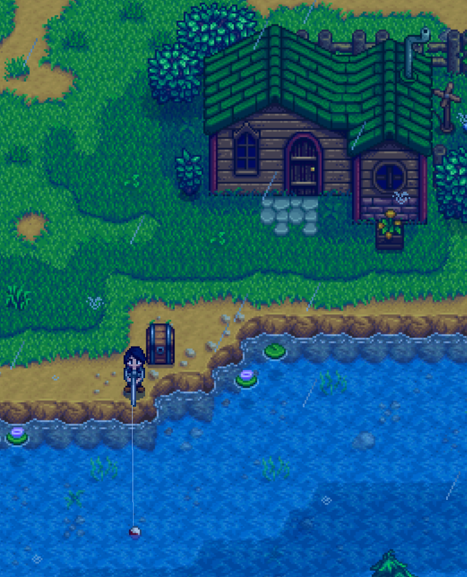
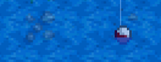

# Year 1, Spring 3

| M                          | Tu                        | W                         | Th                        | F                         | Sa                        | Su                        |
| -------------------------- | ------------------------- | ------------------------- | ------------------------- |-------------------------- | ------------------------- | ------------------------- |
| [1](year-1-spring-1.md)    | [2](year-1-spring-2.md)   | **3**                     | [4](year-1-spring-4.md)   | [5](year-1-spring-5.md)   | [6](year-1-spring-6.md)   | [7](year-1-spring-7.md)   |
| [8](year-1-spring-8.md)    | [9](year-1-spring-9.md)   | [10](year-1-spring-10.md) | [11](year-1-spring-11.md) | [12](year-1-spring-12.md) | [13](year-1-spring-13.md) | [14](year-1-spring-14.md) |
| [15](year-1-spring-15.md)  | [16](year-1-spring-16.md) | [17](year-1-spring-17.md) | [18](year-1-spring-18.md) | [19](year-1-spring-19.md) | [20](year-1-spring-20.md) | [21](year-1-spring-21.md) |
| [22](year-1-spring-22.md)  | [23](year-1-spring-23.md) | [24](year-1-spring-24.md) | [25](year-1-spring-25.md) | [26](year-1-spring-26.md) | [27](year-1-spring-27.md) | [28](year-1-spring-28.md) |

## Goals

- Acquire as much Bait as possible
- Perfect-catch as many fish as possible
- Catch as many [Catfish](https://stardewvalleywiki.com/Catfish) as possible

## Advice and warnings

- At least one [Cauliflower Seed](https://stardewvalleywiki.com/Cauliflower_Seeds) must be planted by this day, watered every single day, and not eaten by [Crows](https://stardewvalleywiki.com/Animals#Crows) in order to successfully complete the [Spring Crops Bundle](https://stardewvalleywiki.com/Cauliflower_Seeds) on Spring 15. Usually, you will plant enough Mixed Seeds on Spring 1 to randomly give at least one [Cauliflower](https://stardewvalleywiki.com/Cauliflower), but it is possible for your run to end here.

## Instructions

### Bait

Tips:

- It always [rains](https://stardewvalleywiki.com/Weather) on Spring 3. When raining, the river in Cindersap Forest is the best place to fish due to the presence of Catfish, which yield a lot of experience and G.

Instructions:

1. Empty all inventory into the Chest. Retrieve the Fiberglass Rod.
2. If you have 80+ Bait and you received [Copper Ore](https://stardewvalleywiki.com/Copper_Ore) from a fishing chest on Spring 2, craft a Chest and take it with you, then skip to the Cindersap Forest section below. Remember to divert from the guide and purchase more Bait from Willy tomorrow before going to The Mountain lake.
3. Retrieve the Hoe from the Chest.
4. Travel to Cindersap Forest.
5. Walk to the tile closest to the river and six tiles west of Leah's door. 
6. Fish so that your bobber lands on the row of tiles shared by the underwater stones tile. This tile is Fishing Zone 5. Casting beyond this tile has no benefit. 
7. Fish until 8:30 am or you run out of Bait, whichever comes first.
8. Travel to the Beach, checking the Garbage Cans below Jodi's and Haley's houses on the way.
9. Check the Beach for forageables and Artifact Spots.
10. Travel to Willy's shop. Sell all fish and any Beach foraging items. Save the lowest-quality [Sardine](https://stardewvalleywiki.com/Sardine) for the [Ocean Fish Bundle](https://stardewvalleywiki.com/Bundles#Ocean_Fish_Bundle).
11. If you received a Copper Ore from a fishing chest on Spring 2, purchase as much Bait as possible; otherwise, save 75g so you can purchase a Copper Ore from Clint later.
    - You should be able to purchase at least 400 Bait, and usually you can expect to receive more from fishing chests. The Bait should last all Spring.
    - Waiting to sell the fish until you have acquired the [Fisher](https://stardewvalleywiki.com/Fishing#Fishing_Skill) profession is not optimal.
12. Empty the contents of the Chest and pick it up.
    - To pick up a Chest without a tool, select an empty slot in your inventory and hold down the left mouse button on the Chest. Your character will strike it repeatedly until it pops free.

### [Furnaces](https://stardewvalleywiki.com/Furnace)

1. If you saved 75g to purchase Copper Ore from Clint, go purchase it now. This ensures Clint appears at The Farm tomorrow and gives you plans to craft Furnaces.
   - You do not have to drop the Copper Ore on the ground or otherwise do anything special with it.
2. Travel to Cindersap Forest.

### Cindersap Forest

1. Walk to the tile closest to the river and six tiles west of Leah's door. Place the Chest northeast by one tile. 
2. Fish so that your bobber lands on the row of tiles shared by the underwater stones tile. This tile is Fishing Zone 5. Casting beyond this tile has no benefit. 
3. Fish until 1:50 am.
4. Fill your inventory with the following:
   - Fiberglass Rod
   - [Ore](https://stardewvalleywiki.com/Ore)
   - Coal
   - [Gems](https://stardewvalleywiki.com/Minerals#Gems)
   - The most expensive items (may be a mix of fish and other items)
     - Consider taking [Chubs](https://stardewvalleywiki.com/Chub) with you if you are concerned about needing Energy for Spring 4.
5. Pass out.

## Day's end

- Fishing level 4 ⟶ 6
