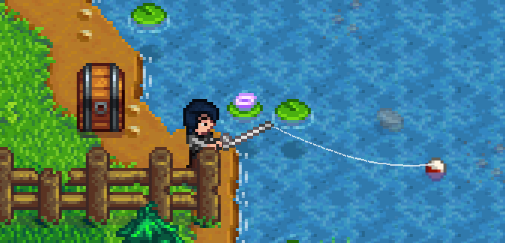
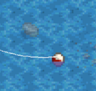

# Year 1, Spring 4

| M                          | Tu                        | W                         | Th                        | F                         | Sa                        | Su                        |
| -------------------------- | ------------------------- | ------------------------- | ------------------------- |-------------------------- | ------------------------- | ------------------------- |
| [1](year-1-spring-1.md)    | [2](year-1-spring-2.md)   | [3](year-1-spring-3.md)   | **4**                     | [5](year-1-spring-5.md)   | [6](year-1-spring-6.md)   | [7](year-1-spring-7.md)   |
| [8](year-1-spring-8.md)    | [9](year-1-spring-9.md)   | [10](year-1-spring-10.md) | [11](year-1-spring-11.md) | [12](year-1-spring-12.md) | [13](year-1-spring-13.md) | [14](year-1-spring-14.md) |
| [15](year-1-spring-15.md)  | [16](year-1-spring-16.md) | [17](year-1-spring-17.md) | [18](year-1-spring-18.md) | [19](year-1-spring-19.md) | [20](year-1-spring-20.md) | [21](year-1-spring-21.md) |
| [22](year-1-spring-22.md)  | [23](year-1-spring-23.md) | [24](year-1-spring-24.md) | [25](year-1-spring-25.md) | [26](year-1-spring-26.md) | [27](year-1-spring-27.md) | [28](year-1-spring-28.md) |

## Goals

- Fish at The Mountain

## Advice and warnings

- From now on, check the Television as soon as the day begins to reveal tomorrow's [Weather](https://stardewvalleywiki.com/Weather) and today's [Luck](https://stardewvalleywiki.com/Luck).
- Any time the weather is about to change from dry to raining or vice versa, read the next day's guide page to determine how you will change your plans to accommodate. For example, let's say today is dry and tomorrow is raining. You know you will be fishing in Cindersap Forest tomorrow, but what if tomorrow's guide page expects you to smelt Ore in a Furnace you placed on The Mountain? You'll have to remember to take the Furnace, Coal, Ore, and Bars with you at day's end so you can continue smelting in Cindersap Forest. Then, once a subsequent day turns dry, you'll have to remember to take the Furnace, Coal, and Ore with you at raining day's end so you can take them to The Mountain the next day. Because the days on which it will rain are unpredictable, forgetting these things will often end your run.
- Walking to the mailbox via the Backwoods and vice versa is nearly 20 minutes faster than via Pelican Town.

## Instructions

### Farming

1. Water crops.
2. If you do not have 150 Wood, fell Trees in the same manner as before until you have 150 Wood. You can fell Oak Trees now that they will drop Acorns. Take your Scythe with you to clear Weeds and Grass.
   - The Wood is for two more Chests and a Scarecrow.
3. Craft a Chest and take it with you.
4. Empty your inventory. Retrieve the Fiberglass Rod and the newly-crafted Chest.
5. Travel to The Mountain.

### Fishing

1. Walk to the fence at the bottom of the screen and continue walking east from there. Place the Chest on the east-most tile on the row of tiles just above the south-most row of tiles. 
2. Fish so that your bobber lands one tile southeast of the underwater stone. This tile is Fishing Zone 5. Casting beyond this tile has no benefit. 
3. Fish until 1:00 am.
4. Fill your inventory with the following:
   - Fiberglass Rod (when raining tomorrow)
   - Ore
   - Coal
   - Gems
   - The most expensive items (may be a mix of fish and other items)
   - Consider keeping Ore and especially Coal. Spring 5 is heavily RNG-dependent and you may find yourself struggling to find [Resources](https://stardewvalleywiki.com/Category:Resources) in The Mines. Your decision will depend on how much risk you wish to take and what tomorrow's Luck will be. If you do decide to keep Ore and/or Coal and it's not raining tomorrow, use the spreadsheet to track how many of each you have, then store them in The Mountain Chest.
   - Consider keeping items that don't sell for much (e.g., Wood). Gathering Wood at this point is Energy-intensive and time-consuming and each Wood only sells for 2g.
   - Consider keeping certain rare Artifacts like [Ancient Seed](https://stardewvalleywiki.com/Ancient_Seed) or other Artifacts that don't sell for much. They can be used later to complete your Museum collection.
5. Travel to The Farm.
6. Ship all sellable items except for the following:
   - Chubs for Energy
   - One of each fish that is used in Community Center Bundles
   - [Diamonds](https://stardewvalleywiki.com/Diamond), [Emeralds](https://stardewvalleywiki.com/Emerald), [Jade](https://stardewvalleywiki.com/Jade), and [Rubies](https://stardewvalleywiki.com/Ruby) for future [Skull Cavern](https://stardewvalleywiki.com/Skull_Cavern) trips
7. If time allows, cut Weeds and Grass.
8. Pass out.

## Day's end

- Fishing level 6 ⟶ 7
